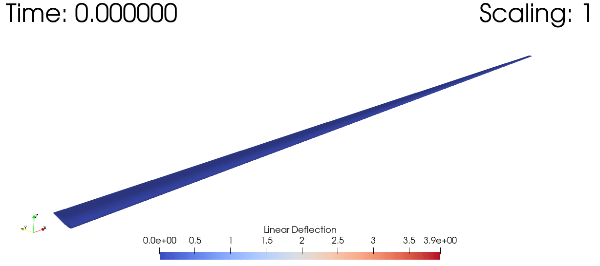

# GXBeam

[](https://flow.byu.edu/GXBeam.jl/stable)
[](https://flow.byu.edu/GXBeam.jl/dev)


*Pure Julia Implementation of Geometrically Exact Beam Theory*

Author: Taylor McDonnell

**GXBeam** is a pure Julia implementation of Geometrically Exact Beam Theory, originally based on the open source code [GEBT](https://cdmhub.org/resources/367) and its associated papers[[1]](#1)[[2]](#2).

As a sample of one of the many things this package can do, here's a time domain simulation of the dynamic response of a joined wing subjected to a simulated gust, scaled up in order to visualize the deflections:


And here's a dynamic simulation of a wind turbine subjected to a sinusoidal tip load.


## Package Features
 - Performs multiple types of analyses including:
    - Linear/Nonlinear static analyses
    - Linear/Nonlinear steady-state dynamic analyses
    - Linear/Nonlinear eigenvalue analyses (by linearizing about a steady state condition)
    - Linear/Nonlinear time-marching dynamic analyses
 - Accurately models arbitrary systems of interconnected highly flexible composite beams.
    - Captures all geometric nonlinearities due to large deflections and rotations
    - Capable of using the full 6x6 Timoshenko beam stiffness matrix
    - Singularity-free rotational deflections of any magnitude using only 3 rotational parameters
 - Models arbitrary time-varying distributed forces/moments on beam elements using:
    - Dead forces/moments (which do not rotate as the beam element rotates)
    - Follower forces/moments (which rotate as the beam element rotates)
    - Forces/moments due to the presence of rigidly attached point masses
    - Forces/moments due to gravitational loads
 - Models arbitrary time-varying prescribed forces/moments and/or displacements/rotations at the connection points between beam elements using:
    - Dead forces/moments (which do not rotate as the point rotates)
    - Follower forces/moments (which rotate as the point rotates)
 - Capable of using arbitrary units (as long as they are compatible)
 - Simple result visualization using [WriteVTK](https://github.com/jipolanco/WriteVTK.jl)
 - Built-in [DifferentialEquations](https://github.com/SciML/DifferentialEquations.jl) interface for time domain simulations.
 - Extensively validated against published analytical and computational results.  See the [examples in the documentation](https://flow.byu.edu/GXBeam.jl/dev/examples/).

## Installation

Enter the package manager by typing `]` and then run the following:

```julia
pkg> add GXBeam
```

## Performance

This code has been optimized to be highly performant, primarily by maintaining type stability and minimizing allocations.  As a result the performance of this package rivals (or even outperforms) that of the Fortran implementation in GEBT.  At this point, differences in performance between the two codes can be primarily attributed to the performance of the sparse linear system solver in each.

## Usage

See the [documentation](https://flow.byu.edu/GXBeam.jl/dev)

Note that while the theoretical basis for this code is identical to Wenbin Yu's code, some of the implementation details vary.

## References
<a id="1">[1]</a>
Yu, W., & Blair, M. (2012).
GEBT: A general-purpose nonlinear analysis tool for composite beams.
Composite Structures, 94(9), 2677-2689.

<a id="2">[2]</a>
Wang, Q., & Yu, W. (2017).
Geometrically nonlinear analysis of composite beams using Wiener-Milenković parameters.
Journal of Renewable and Sustainable Energy, 9(3), 033306.
