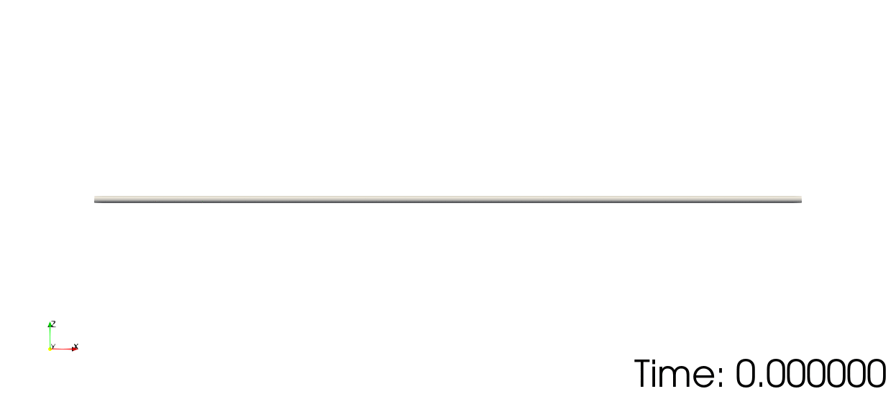
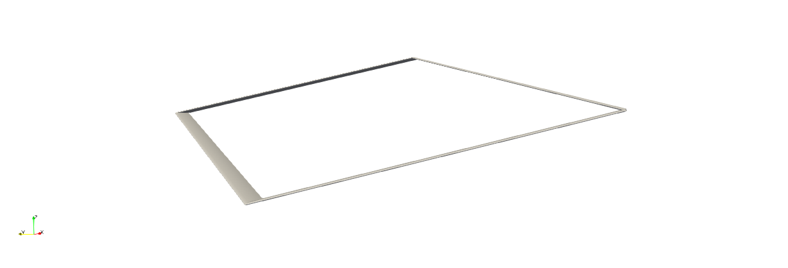

# Examples

These examples show how to use the various analysis capabilities of GEBT.jl.  Many of these examples also provide a verification/validation for the implementation of geometrically exact beam theory in GEBT.jl.


```@contents
Pages = ["examples.md"]
Depth = 3
```

```@setup examples
# this is placed here to pre-install matplotlib so the documentation doesn't get cluttered with the installation print statements.
using Plots
pyplot()
```

## Linear Analysis of a Cantilever Partially Under a Uniform Distributed Load

This example shows how to predict the behavior of a cantilever beam which is partially subjected to a uniform distributed load.


```@example linear-cantilever-pudl

using GEBT, LinearAlgebra

nelem = 12

# create points
a = 0.3
b = 0.7
L = 1.0
n1 = n3 = div(nelem, 3)
n2 = nelem - n1 - n3
x1 = range(0, 0.3, length=n1+1)
x2 = range(0.3, 0.7, length=n2+1)
x3 = range(0.7, 1.0, length=n3+1)
x = vcat(x1, x2[2:end], x3[2:end])
y = zero(x)
z = zero(x)
points = [[x[i],y[i],z[i]] for i = 1:length(x)]

# index of endpoints for each beam element
start = 1:nelem
stop = 2:nelem+1

# create compliance matrix for each beam element
EI = 1e9
compliance = fill(Diagonal([0, 0, 0, 0, 1/EI, 0]), nelem)

# create assembly
assembly = Assembly(points, start, stop, compliance=compliance)

# set prescribed conditions (fixed right endpoint)
prescribed_conditions = Dict(
    nelem+1 => PrescribedConditions(ux=0, uy=0, uz=0, theta_x=0, theta_y=0, theta_z=0)
)

# create distributed load
q = 1000
distributed_loads = Dict()
for ielem in n1+1:n1+n2
    distributed_loads[ielem] = DistributedLoads(assembly, ielem; fz = (s) -> q)
end

system, converged = static_analysis(assembly, prescribed_conditions=prescribed_conditions,
    distributed_loads=distributed_loads, linear=true)

state = AssemblyState(system, assembly, prescribed_conditions=prescribed_conditions)

nothing #hide
```

We can construct the analytical solution for this problem by integrating from the free end of the beam and applying the appropriate boundary conditions.

```@example linear-cantilever-pudl
# construct analytical solution
dx = 1e-6
x_a = 0.0:dx:L
q_a = (x) -> a <= x <= b ? -q : 0 # define distributed load
V_a = cumsum(-q_a.(x_a) .* dx) # integrate to get shear
M_a = cumsum(V_a .* dx) # integrate to get moment
slope_a = cumsum(M_a./EI .* dx) # integrate to get slope
slope_a .-= slope_a[end] # apply boundary condition
deflection_a = cumsum(slope_a .* dx) # integrate to get deflection
deflection_a .-= deflection_a[end] # apply boundary condition

# get elastic twist angle
theta_a = -atan.(slope_a)

# adjust coordinate system of the analytical solution to match the computational solution
M_a = -M_a

nothing #hide
```

Plotting the results reveals that the analytical and computational solutions show excellent agreement.

```@example linear-cantilever-pudl
using Plots
pyplot()

# deflection plot
plot(
    xlim = (0.0, 1.0),
    xticks = 0.0:0.2:1.0,
    xlabel = "x (m)",
    ylabel = "Deflection (m)",
    grid = false,
    overwrite_figure=false
    )

x = [assembly.points[ipoint][1] + state.points[ipoint].u[1] for ipoint = 1:length(assembly.points)]
deflection = [state.points[ipoint].u[3] for ipoint = 1:length(assembly.points)]
plot!(x_a, deflection_a, label="Analytical")
scatter!(x, deflection, label="GEBT")

savefig("linear-cantilever-pudl-1.svg") #hide

# elastic twist plot (euler angle)
plot(
    xlim = (0.0, 1.0),
    xticks = 0.0:0.2:1.0,
    xlabel = "x (m)",
    yticks = 0.0:5e-7:3.5e-6,
    ylabel = "Rotation Parameter \$\\theta_y\$",
    grid = false,
    overwrite_figure=false
    )

x = [assembly.points[ipoint][1] + state.points[ipoint].u[1] for ipoint = 1:length(assembly.points)]
theta = [4*atan.(state.points[ipoint].theta[2]/4) for ipoint = 1:length(assembly.points)]
plot!(x_a, theta_a, label="Analytical")
scatter!(x, theta, label="GEBT")

savefig("linear-cantilever-pudl-2.svg") #hide

# bending moment plot
plot(
    xlim = (0.0, 1.0),
    xticks = 0.0:0.2:1.0,
    xlabel = "x (m)",
    yticks = 0.0:-50:-200,
    ylabel = "Bending Moment (\$Nm\$)",
    grid = false,
    overwrite_figure=false
    )

x = [assembly.elements[ielem].x[1] + state.elements[ielem].u[1] for ielem = 1:length(assembly.elements)]
M = [state.elements[ielem].M[2] for ielem = 1:length(assembly.elements)]
plot!(x_a, M_a, label="Analytical")
scatter!(x, M, label="GEBT")

savefig("linear-cantilever-pudl-3.svg") #hide
nothing #hide
```


Note that we could have easily performed a nonlinear analysis for this problem by setting `linear=false`.

## Linear Analysis of a Beam Under a Linear Distributed Load

This example shows how to predict the behavior of a beam which is clamped at one end and simply supported at the other end when subjected to a linear distributed load.


```@example linear-overdetermined-ldl

using GEBT, LinearAlgebra

nelem = 16

# create points
L = 1
x = range(0, L, length=nelem+1)
y = zero(x)
z = zero(x)
points = [[x[i],y[i],z[i]] for i = 1:length(x)]

# index of endpoints for each beam element
start = 1:nelem
stop = 2:nelem+1

# create compliance matrix for each beam element
EI = 1e7
compliance = fill(Diagonal([0, 0, 0, 0, 1/EI, 0]), nelem)

# create assembly
assembly = Assembly(points, start, stop, compliance=compliance)

# set prescribed conditions
prescribed_conditions = Dict(
    # simply supported left endpoint
    1 => PrescribedConditions(uz=0),
    # clamped right endpoint
    nelem+1 => PrescribedConditions(ux=0, uy=0, uz=0, theta_x=0, theta_y=0, theta_z=0)
)

# create distributed load
qmax = 1000
distributed_loads = Dict()
for i = 1:nelem
    distributed_loads[i] = DistributedLoads(assembly, i; s1=x[i],
        s2=x[i+1], fz = (s) -> qmax*s)
end

# perform a static analysis
system, converged = static_analysis(assembly, prescribed_conditions=prescribed_conditions,
    distributed_loads=distributed_loads, linear=true)

# post-process the results
state = AssemblyState(system, assembly, prescribed_conditions=prescribed_conditions)

nothing #hide
```

An analytical solution to this over-determined problem can be found using the method of superposition using the analytical solutions to a cantilever with a linearly distributed load and a cantilever with an end load.

```@example linear-overdetermined-ldl
# construct analytical solution
x_a = range(0.0, L, length=1000)
w_a = @. qmax*(1-x_a)^2/(120*EI)*(4 - 8*(1-x_a) + 5*(1-x_a)^2 - (1-x_a)^3)
slope_a = @. -qmax*(1-x_a)/(120*EI)*(8 - 24*(1-x_a) + 20*(1-x_a)^2 - 5*(1-x_a)^3)
M_a = @. qmax/120*(8 - 48*(1-x_a) + 60*(1-x_a)^2 - 20*(1-x_a)^3)

theta_a = -atan.(slope_a)

# adjust coordinate system of analytical solution
M_a = -M_a

nothing #hide
```

Plotting the results reveals that the analytical and computational solutions show excellent agreement.

```@example linear-overdetermined-ldl
using Plots
pyplot()

# set up the plot
plot(
    xlim = (0.0, 1.0),
    xticks = 0.0:0.2:1.0,
    xlabel = "x (m)",
    ylabel = "Deflection (m)",
    grid = false,
    overwrite_figure=false
    )

x = [assembly.points[ipoint][1] + state.points[ipoint].u[1] for ipoint = 1:length(assembly.points)]
deflection = [state.points[ipoint].u[3] for ipoint = 1:length(assembly.points)]
plot!(x_a, w_a, label="Analytical")
scatter!(x, deflection, label="GEBT")

savefig("linear-overdetermined-ldl-1.svg") #hide

plot(
    xlim = (0.0, 1.0),
    xticks = 0.0:0.2:1.0,
    xlabel = "x (m)",
    ylabel = "Rotation Parameter \$\\theta_y\$",
    grid = false,
    overwrite_figure=false
    )

x = [assembly.points[ipoint][1] + state.points[ipoint].u[1] for ipoint = 1:length(assembly.points)]
theta = [4*atan.(state.points[ipoint].theta[2]/4) for ipoint = 1:length(assembly.points)]
plot!(x_a, theta_a, label="Analytical")
scatter!(x, theta, label="GEBT")

savefig("linear-overdetermined-ldl-2.svg") #hide

plot(
    xlim = (0.0, 1.0),
    xticks = 0.0:0.2:1.0,
    xlabel = "x (m)",
    ylabel = "Bending Moment (\$Nm\$)",
    grid = false,
    overwrite_figure=false
    )

x = [assembly.elements[ielem].x[1] + state.elements[ielem].u[1] for ielem = 1:length(assembly.elements)]
M = [state.elements[ielem].M[2] for ielem = 1:length(assembly.elements)]
plot!(x_a, M_a, label="Analytical")
scatter!(x, M, label="GEBT")

savefig("linear-overdetermined-ldl-3.svg") #hide
nothing #hide
```


Note that we could have easily performed a nonlinear analysis for this problem by setting `linear=false`.

## Nonlinear Analysis of a Cantilever Subjected to a Constant Tip Load

This example shows how to predict the behavior of a cantilever beam that is subjected to a constant tip load.


```@example cantilever-tipforce

using GEBT, LinearAlgebra

L = 1
EI = 1e6

# shear force (applied at end)
λ = 0:0.5:16
p = EI/L^2
P = λ*p

# create points
nelem = 16
x = range(0, L, length=nelem+1)
y = zero(x)
z = zero(x)
points = [[x[i],y[i],z[i]] for i = 1:length(x)]

# index of endpoints of each beam element
start = 1:nelem
stop = 2:nelem+1

# compliance matrix for each beam element
compliance = fill(Diagonal([0, 0, 0, 0, 1/EI, 0]), nelem)

# create assembly of interconnected nonlinear beams
assembly = Assembly(points, start, stop, compliance=compliance)

# pre-initialize system storage
static = true
keep_points = [1, nelem+1] # points that we request are included in the system of equations
system = System(assembly, keep_points, static)

# run an analysis for each prescribed tip load
states = Vector{AssemblyState{Float64}}(undef, length(P))
for i = 1:length(P)

    # create dictionary of prescribed conditions
    prescribed_conditions = Dict(
        # fixed left side
        1 => PrescribedConditions(ux=0, uy=0, uz=0, theta_x=0, theta_y=0, theta_z=0),
        # shear force on right tip
        nelem+1 => PrescribedConditions(Fz = P[i])
    )

    # perform a static analysis
    static_analysis!(system, assembly, prescribed_conditions=prescribed_conditions)

    # post-process the results
    states[i] = AssemblyState(system, assembly, prescribed_conditions=prescribed_conditions)

end
```

The analytical solution to this problem has been presented by several authors.  Here we follow the solution by H. J. Barten in "On the Deflection of a Cantilever Beam", after incorporating the corrections they submitted for finding the tip angle.

```@example cantilever-tipforce
import Elliptic

δ = range(pi/4, pi/2, length=10^5)[2:end-1]

k = @. cos(pi/4)/sin(δ)
λ_a = @. (Elliptic.F(pi/2, k^2) - Elliptic.F(δ,  k^2))^2

θ_a = @. 2*(pi/4 - acos(k))

ξ_a = @. sqrt(2*sin(θ_a)/λ_a) .- 1

η_a = @. 1-2/sqrt(λ_a)*(Elliptic.E(pi/2, k^2) - Elliptic.E(δ, k^2))

nothing #hide
```

Plotting the results reveals that the analytical and computational solutions show excellent agreement.

```@example cantilever-tipforce
using Plots
pyplot()

u = [states[i].points[end].u[1] for i = 1:length(P)]
θ = [states[i].points[end].theta[2] for i = 1:length(P)]
w = [states[i].points[end].u[3] for i = 1:length(P)]

# set up the plot
plot(
    xlim = (0, 16),
    xticks = 0:1:16,
    xlabel = "Nondimensional Force \$\\left(\\frac{PL^2}{EI}\\right)\$",
    ylim = (0, 1.2),
    yticks = 0.0:0.2:1.2,
    ylabel = "Nondimensional Tip Displacements",
    grid = false,
    overwrite_figure=false
    )

plot!([Inf], [Inf], color=:black, label="Analytical")
scatter!([Inf], [Inf], color=:black, label="GEBT")
plot!([Inf], [Inf], color=1, label="Vertical \$\\left(w/L\\right)\$")
plot!([Inf], [Inf], color=2, label="Horizontal \$\\left(-u/L\\right)\$")
plot!([Inf], [Inf], color=3, label="\$ \\theta/(\\pi/2) \$")

plot!(λ_a, η_a, color=1, label="")
scatter!(λ, w/L, color=1, label="")

plot!(λ_a, -ξ_a, color=2, label="")
scatter!(λ, -u/L, color=2, label="")

plot!(λ_a, θ_a*2/pi, color=3, label="")
scatter!(λ, -4*atan.(θ/4)*2/pi, color=3, label="")

savefig("cantilever-tipforce.svg"); nothing #hide
```


## Nonlinear Analysis of a Cantilever Subjected to a Constant Moment

This example shows how to predict the behavior of a cantilever beam that is subjected to a constant tip moment.  This is a common benchmark problem for the geometrically nonlinear analysis of beams.


```@example cantilever-tipmoment

using GEBT, LinearAlgebra

L = 12 # inches
h = w = 1 # inches
E = 30e6 # lb/in^4 Young's Modulus

A = h*w
Iyy = w*h^3/12
Izz = w^3*h/12

# bending moment (applied at end)
λ = [0.0, 0.4, 0.8, 1.2, 1.6, 1.8, 2.0]
m = pi*E*Iyy/L
M = λ*m

# create points
nelem = 16
x = range(0, L, length=nelem+1)
y = zero(x)
z = zero(x)
points = [[x[i],y[i],z[i]] for i = 1:length(x)]

# index of endpoints of each beam element
start = 1:nelem
stop = 2:nelem+1

# compliance matrix for each beam element
compliance = fill(Diagonal([1/(E*A), 0, 0, 0, 1/(E*Iyy), 1/(E*Izz)]), nelem)

# create assembly of interconnected nonlinear beams
assembly = Assembly(points, start, stop, compliance=compliance)

# pre-initialize system storage
static = true
keep_points = [1, nelem+1] # points that we request are included in the system of equations
system = System(assembly, keep_points, static)

# run an analysis for each prescribed bending moment
states = Vector{AssemblyState{Float64}}(undef, length(M))
for i = 1:length(M)

    # create dictionary of prescribed conditions
    prescribed_conditions = Dict(
        # fixed left side
        1 => PrescribedConditions(ux=0, uy=0, uz=0, theta_x=0, theta_y=0, theta_z=0),
        # moment on right side
        nelem+1 => PrescribedConditions(Mz = M[i])
    )

    # perform a static analysis
    static_analysis!(system, assembly, prescribed_conditions=prescribed_conditions)

    # post-process the results
    states[i] = AssemblyState(system, assembly, prescribed_conditions=prescribed_conditions)

end

nothing #hide
```

This problem has a simple analytical solution, which we obtained from "Study of the Geometric Stiffening Effect: Comparison of Different Formulations" by Juana M. Mayo, Daniel Garcia-Vallejo, and Jaime Dominguez.

```@example cantilever-tipmoment

# analytical solution (ρ = E*I/M)
analytical(x, ρ) = ifelse(ρ == Inf, zeros(3), [ρ*sin(x/ρ)-x, ρ*(1-cos(x/ρ)), 0])

nothing #hide
```

Plotting the results reveals that the analytical and computational results show excellent agreement.

```@example cantilever-tipmoment
using Plots
pyplot()

# set up the plot
plot(
    xlim = (-0.25, 1.1),
    xticks = -0.25:0.25:1.0,
    xlabel = "x/L",
    ylim = (-0.05, 0.8),
    yticks = 0.0:0.2:0.8,
    ylabel = "y/L",
    aspect_ratio = 1.0,
    grid = false,
    overwrite_figure=false
    )

# create dummy legend entries for GEBT and Analytical
scatter!([NaN, NaN], [NaN, NaN], color=:black, label="GEBT")
plot!([NaN, NaN], [NaN, NaN], color=:black, label="Analytical")

# plot the data
for i = 1:length(M)
    local x, y #hide
    # GEBT
    x = [assembly.points[ipoint][1] + states[i].points[ipoint].u[1] for ipoint = 1:length(assembly.points)]
    y = [assembly.points[ipoint][2] + states[i].points[ipoint].u[2] for ipoint = 1:length(assembly.points)]
    scatter!(x/L, y/L, label="", color = i)

    # Analytical
    x0 = range(0, L, length=100)
    deflection = analytical.(x0, E*Iyy/M[i])
    x = (x0 + getindex.(deflection, 1))
    y = getindex.(deflection, 2)
    plot!(x/L, y/L, label="λ=$(λ[i])", color=i)
end

savefig("cantilever-tipmoment.svg"); nothing #hide
```


## Nonlinear Analysis of the Bending of a Curved Beam in 3D Space

This example is also a common benchmark problem for the geometrically exact bending of nonlinear beams.


```@example cantilever-curved
using GEBT, LinearAlgebra

# problem constants
R = 100
L = R*pi/4 # inches
h = w = 1 # inches
E = 1e7 # psi Young's Modulus
ν = 0.0
G = E/(2*(1+ν))

# beam starting point, frame, and curvature
start = [0, 0, 0]
frame = [0 -1 0; 1 0 0; 0 0 1]
curvature = [0, 0, -1/R]

# cross section properties
A = h*w
Ay = A
Az = A
Iyy = w*h^3/12
Izz = w^3*h/12
J = Iyy + Izz

# discretize the beam
nelem = 16
ΔL, xp, xm, Cab = discretize_beam(L, start, nelem; frame=frame, curvature=curvature)

# force
P = 600 # lbs

# index of left and right endpoints of each beam element
pt1 = 1:nelem
pt2 = 2:nelem+1

# compliance matrix for each beam element
compliance = fill(Diagonal([1/(E*A), 1/(G*Ay), 1/(G*Az), 1/(G*J), 1/(E*Iyy), 1/(E*Izz)]), nelem)

# create assembly of interconnected nonlinear beams
assembly = Assembly(xp, pt1, pt2, compliance=compliance, frames=Cab,
    lengths=ΔL, midpoints=xm)

# create dictionary of prescribed conditions
prescribed_conditions = Dict(
    # fixed left endpoint
    1 => PrescribedConditions(ux=0, uy=0, uz=0, theta_x=0, theta_y=0, theta_z=0),
    # force on right endpoint
    nelem+1 => PrescribedConditions(Fz=P)
)

# perform static analysis
system, converged = static_analysis(assembly, prescribed_conditions=prescribed_conditions)

# post-process results
state = AssemblyState(system, assembly, prescribed_conditions=prescribed_conditions)

println("Tip Displacement: ", state.points[end].u)
println("Tip Displacement (Bathe and Bolourch): [-13.4, -23.5, 53.4]")

nothing #hide
```

The calculated tip displacements match those reported by Bathe and Bolourch in "Large Displacement Analysis of Three-Dimensional Beam Structures" closely, thus verifying our GEBT implementation.

We can visualize the deformed geometry and inspect the associated point and element data using ParaView.

```@example cantilever-curved
write_vtk("cantilever-curved", assembly, state)
nothing #hide
```


## Rotating Beam with a Swept Tip

In this example we analyze a rotating beam with a swept tip.  The parameters for this example come from "Finite element solution of nonlinear intrinsic equations for curved composite beams" by Hodges, Shang, and Cesnik.


```@example rotating-beam

using GEBT, LinearAlgebra

sweep = 45 * pi/180
rpm = 0:25:750

# straight section of the beam
L_b1 = 31.5 # inch
r_b1 = [2.5, 0, 0]
nelem_b1 = 13
lengths_b1, xp_b1, xm_b1, Cab_b1 = discretize_beam(L_b1, r_b1, nelem_b1)

# swept section of the beam
L_b2 = 6 # inch
r_b2 = [34, 0, 0]
nelem_b2 = 3
cs, ss = cos(sweep), sin(sweep)
frame_b2 = [cs ss 0; -ss cs 0; 0 0 1]
lengths_b2, xp_b2, xm_b2, Cab_b2 = discretize_beam(L_b2, r_b2, nelem_b2, frame=frame_b2)

# combine elements and points into one array
nelem = nelem_b1 + nelem_b2
points = vcat(xp_b1, xp_b2[2:end])
start = 1:nelem_b1 + nelem_b2
stop = 2:nelem_b1 + nelem_b2 + 1
lengths = vcat(lengths_b1, lengths_b2)
midpoints = vcat(xm_b1, xm_b2)
Cab = vcat(Cab_b1, Cab_b2)

# cross section
w = 1 # inch
h = 0.063 # inch

# material properties
E = 1.06e7 # lb/in^2
ν = 0.325
ρ = 2.51e-4 # lb sec^2/in^4

# shear and torsion correction factors
ky = 1.2000001839588001
kz = 14.625127919304001
kt = 65.85255016982444

A = h*w
Iyy = w*h^3/12
Izz = w^3*h/12
J = Iyy + Izz

# apply corrections
Ay = A/ky
Az = A/kz
Jx = J/kt

G = E/(2*(1+ν))

compliance = fill(Diagonal([1/(E*A), 1/(G*Ay), 1/(G*Az), 1/(G*Jx), 1/(E*Iyy), 1/(E*Izz)]), nelem)

mass = fill(Diagonal([ρ*A, ρ*A, ρ*A, ρ*J, ρ*Iyy, ρ*Izz]), nelem)

# create assembly
assembly = Assembly(points, start, stop, compliance=compliance, mass=mass, frames=Cab, lengths=lengths, midpoints=midpoints)

# create dictionary of prescribed conditions
prescribed_conditions = Dict(
    # root section is fixed
    1 => PrescribedConditions(ux=0, uy=0, uz=0, theta_x=0, theta_y=0, theta_z=0)
    )

nonlinear_states = Vector{AssemblyState{Float64}}(undef, length(rpm))
linear_states = Vector{AssemblyState{Float64}}(undef, length(rpm))
for i = 1:length(rpm)
    # global frame rotation
    w0 = [0, 0, rpm[i]*(2*pi)/60]

    # perform nonlinear steady state analysis
    system, converged = steady_state_analysis(assembly,
        angular_velocity = w0,
        prescribed_conditions = prescribed_conditions)

    nonlinear_states[i] = AssemblyState(system, assembly, prescribed_conditions=prescribed_conditions)

    # perform linear steady state analysis
    system, converged = steady_state_analysis(assembly,
        angular_velocity = w0,
        prescribed_conditions = prescribed_conditions,
        linear = true)

    linear_states[i] = AssemblyState(system, assembly, prescribed_conditions=prescribed_conditions)
end

nothing #hide
```

To visualize the solutions we will plot the root moment and tip deflections against the angular speed.

```@example rotating-beam
using Plots
pyplot()

# root moment
plot(
    xlim = (0, 760),
    xticks = 0:100:750,
    xlabel = "Angular Speed (RPM)",
    yticks = 0.0:2:12,
    ylabel = "\$M_z\$ at the root (lb-in)",
    grid = false,
    overwrite_figure=false
    )
Mz_nl = [-nonlinear_states[i].points[1].M[3] for i = 1:length(rpm)]
Mz_l = [-linear_states[i].points[1].M[3] for i = 1:length(rpm)]
plot!(rpm, Mz_nl, label="Nonlinear")
plot!(rpm, Mz_l, label="Linear")

savefig("rotating-beam-Mz.svg"); nothing #hide

# x tip deflection
plot(
    xlim = (0, 760),
    xticks = 0:100:750,
    xlabel = "Angular Speed (RPM)",
    ylim = (-0.002, 0.074),
    yticks = 0.0:0.01:0.07,
    ylabel = "\$u_x\$ at the tip (in)",
    grid = false,
    overwrite_figure=false
    )
ux_nl = [nonlinear_states[i].points[end].u[1] for i = 1:length(rpm)]
ux_l = [linear_states[i].points[end].u[1] for i = 1:length(rpm)]
plot!(rpm, ux_nl, label="Nonlinear")
plot!(rpm, ux_l, label="Linear")

savefig("rotating-beam-ux.svg"); nothing #hide

# y tip deflection
plot(
    xlim = (0, 760),
    xticks = 0:100:750,
    xlabel = "Angular Speed (RPM)",
    ylim = (-0.01, 0.27),
    yticks = 0.0:0.05:0.25,
    ylabel = "\$u_y\$ at the tip (in)",
    grid = false,
    overwrite_figure=false
    )
uy_nl = [nonlinear_states[i].points[end].u[2] for i = 1:length(rpm)]
uy_l = [linear_states[i].points[end].u[2] for i = 1:length(rpm)]
plot!(rpm, uy_nl, label="Nonlinear")
plot!(rpm, uy_l, label="Linear")

savefig("rotating-beam-uy.svg"); nothing #hide

# rotation of the tip
plot(
    xlim = (0, 760),
    xticks = 0:100:750,
    xlabel = "Angular Speed (RPM)",
    ylabel = "\$θ_z\$ at the tip",
    grid = false,
    overwrite_figure=false
    )
theta_z_nl = [4*atan(nonlinear_states[i].points[end].theta[3]/4) for i = 1:length(rpm)]
theta_z_l = [4*atan(linear_states[i].points[end].theta[3]/4) for i = 1:length(rpm)]

plot!(rpm, theta_z_nl, label="Nonlinear")
plot!(rpm, theta_z_l, label="Linear")

savefig("rotating-beam-theta_z.svg"); nothing #hide
```


We will now compute the eigenvalues of this system for a range of sweep angles and and angular speeds.

```@example rotating-beam

sweep = (0:2.5:45) * pi/180
rpm = [0, 500, 750]
nev = 30

λ = Matrix{Vector{ComplexF64}}(undef, length(sweep), length(rpm))
U = Matrix{Matrix{ComplexF64}}(undef, length(sweep), length(rpm))
MV = Matrix{Matrix{ComplexF64}}(undef, length(sweep), length(rpm))
state = Matrix{AssemblyState{Float64}}(undef, length(sweep), length(rpm))
eigenstates = Matrix{Vector{AssemblyState{ComplexF64}}}(undef, length(sweep), length(rpm))
for i = 1:length(sweep)
    local L_b1, r_b1, nelem_b1, lengths_b1 #hide
    local xp_b1, xm_b1, Cab_b1 #hide
    local cs, ss #hide
    local L_b2, r_b2, nelem_b2, frame_b2, lengths_b2 #hide
    local xp_b2, xm_b2, Cab_b2 #hide
    local nelem, points, start, stop #hide
    local lengths, midpoints, Cab, compliance, mass, assembly #hide

    # straight section of the beam
    L_b1 = 31.5 # inch
    r_b1 = [2.5, 0, 0]
    nelem_b1 = 20
    lengths_b1, xp_b1, xm_b1, Cab_b1 = discretize_beam(L_b1, r_b1, nelem_b1)

    # swept section of the beam
    L_b2 = 6 # inch
    r_b2 = [34, 0, 0]
    nelem_b2 = 20
    cs, ss = cos(sweep[i]), sin(sweep[i])
    frame_b2 = [cs ss 0; -ss cs 0; 0 0 1]
    lengths_b2, xp_b2, xm_b2, Cab_b2 = discretize_beam(L_b2, r_b2, nelem_b2, frame=frame_b2)

    # combine elements and points into one array
    nelem = nelem_b1 + nelem_b2
    points = vcat(xp_b1, xp_b2[2:end])
    start = 1:nelem_b1 + nelem_b2
    stop = 2:nelem_b1 + nelem_b2 + 1
    lengths = vcat(lengths_b1, lengths_b2)
    midpoints = vcat(xm_b1, xm_b2)
    Cab = vcat(Cab_b1, Cab_b2)

    compliance = fill(Diagonal([1/(E*A), 1/(G*Ay), 1/(G*Az), 1/(G*Jx), 1/(E*Iyy), 1/(E*Izz)]), nelem)

    mass = fill(Diagonal([ρ*A, ρ*A, ρ*A, ρ*J, ρ*Iyy, ρ*Izz]), nelem)

    # create assembly
    assembly = Assembly(points, start, stop, compliance=compliance, mass=mass, frames=Cab, lengths=lengths, midpoints=midpoints)

    # create system
    keep_points = [1, nelem_b1+1, nelem+1] # points that we request are included in the system of equations
    system = System(assembly, keep_points, false)

    for j = 1:length(rpm)
        # global frame rotation
        w0 = [0, 0, rpm[j]*(2*pi)/60]

        # eigenvalues and (right) eigenvectors
        system, λ[i,j], V, converged = eigenvalue_analysis!(system, assembly,
            angular_velocity = w0,
            prescribed_conditions = prescribed_conditions,
            nev=nev)

        # corresponding left eigenvectors
        U[i,j] = left_eigenvectors(system, λ[i,j], V)

        # post-multiply mass matrix with right eigenvector matrix
        # (we use this later for correlating eigenvalues)
        MV[i,j] = system.M * V

        # process state and eigenstates
        state[i,j] = AssemblyState(system, assembly; prescribed_conditions=prescribed_conditions)
        eigenstates[i,j] = [AssemblyState(system, assembly, V;
            prescribed_conditions=prescribed_conditions) for k = 1:nev]
    end
end

nothing #hide
```

We can correlate each eigenmode by taking advantage of the fact that left and right eigenvectors satisfy the following relationships:

```math
\begin{aligned}
u^H M v &= 1 &\text{if \(u\) and \(v\) correspond to the same eigenmode} \\
u^H M v &= 0 &\text{if \(u\) and \(v\) correspond to different eigenmodes}
\end{aligned}
```

```@example rotating-beam

# set previous left eigenvector matrix
U_p = copy(U[1,1])

for j = 1:length(rpm)
    for i = 1:length(sweep)
        # construct correlation matrix
        C = U_p*MV[i,j]

        # correlate eigenmodes
        perm, corruption = correlate_eigenmodes(C)

        # re-arrange eigenvalues and eigenvectors
        λ[i,j] = λ[i,j][perm]
        U[i,j] = U[i,j][perm,:]
        MV[i,j] = MV[i,j][:,perm]
        eigenstates[i,j] = eigenstates[i,j][perm]

        # update previous eigenvector matrix
        U_p .= U[i,j]
    end
    # update previous eigenvector matrix
    U_p .= U[1,j]
end

frequency = [[imag(λ[i,j][k])/(2*pi) for i = 1:length(sweep), j=1:length(rpm)] for k = 2:2:nev]

nothing #hide
```

In this case these eigenmode correlations work, but remember that large changes in the underlying parameters (or just drastic changes in the eigenvectors themselves due to a small perturbation) can cause these automatic eigenmode correlations to fail.

We'll now plot the frequency of the different eigenmodes against those found by Epps and Chandra in "The Natural Frequencies of Rotating Composite Beams With Tip Sweep".

```@example rotating-beam
names = ["First Bending Mode", "Second Bending Mode", "Third Bending Mode"]
indices = [1, 2, 4]

experiment_rpm = [0, 500, 750]
experiment_sweep = [0, 15, 30, 45]
experiment_frequencies = [
    [1.4 1.8 1.7 1.6;
     10.2 10.1 10.2 10.2;
     14.8 14.4 14.9 14.7],
    [10.3 10.2 10.4 10.4;
     25.2 25.2 23.7 21.6;
     36.1 34.8 30.7 26.1],
    [27.7 27.2 26.6 24.8;
     47.0 44.4 39.3 35.1;
     62.9 55.9 48.6 44.8]
]

plot!([NaN, NaN], [NaN, NaN], color=:black, label="GEBT")
scatter!([NaN, NaN], [NaN, NaN], color=:black, label="Experiment (Epps and Chandra)")

for k = 1:length(indices)
    plot(
        title = names[k],
        xticks = 0:15:45,
        xlabel = "Sweep Angle (degrees)",
        ylim = (0, Inf),
        ylabel = "Frequency (Hz)",
        grid = false,
        overwrite_figure=false
        )

    for j = length(rpm):-1:1
        plot!(sweep*180/pi, frequency[indices[k]][:,j], label="$(rpm[j]) RPM", color=j)
        scatter!(experiment_sweep, experiment_frequencies[k][j,:],
            label="", color=j)
    end

    plot!(show=true)
    savefig("rotating-beam-frequencies-$(k).svg") #hide
end

names = ["1T/5B", "5B/1T", "4B/1T"]
indices = [5, 7, 6]

experiment_frequencies = [
    132.7 147.3 166.2 162.0
    106.6 120.1 122.6 117.7;
    95.4 87.5 83.7 78.8;
]

plot(
    title = "Coupled Torsion-Bending Modes at 750 RPM",
    xticks = 0:15:45,
    xlabel = "Sweep Angle (degrees)",
    ylim = (0, Inf),
    ylabel = "Frequency (Hz)",
    grid = false,
    overwrite_figure=false
    )

plot!([NaN, NaN], [NaN, NaN], color=:black, label="GEBT")
scatter!([NaN, NaN], [NaN, NaN], color=:black, label="Experiment (Epps and Chandra)")

for k = 1:length(indices)
    plot!(sweep*180/pi, frequency[indices[k]][:,end], label=names[k], color=k)
    scatter!(experiment_sweep, experiment_frequencies[k,:],
        label="", color=k)
end

plot!(show=true)

savefig("rotating-beam-frequencies-4.svg"); nothing #hide

nothing #hide
```


As you can see, the frequency results from the eigenmode analysis in this package compare well with experimental results.

We can also visualize eigenmodes using ParaView.  Here we will visualize the first bending mode for the 45 degree swept tip at a rotational speed of 750 RPM.  This can be helpful for identifying different eigenmodes.

```@example rotating-beam
write_vtk("rotating-beam-45d-750rpm-bending-mode-1", assembly, state[end,end], λ[end,end][1],
    eigenstates[end,end][1], mode_scaling=100.0)
nothing #hide
```


## Nonlinear Dynamic Analysis of a Wind Turbine Blade

```@example dynamic-wind-turbine

using GEBT, LinearAlgebra

L = 60 # m

# create points
nelem = 10
x = range(0, L, length=nelem+1)
y = zero(x)
z = zero(x)
points = [[x[i],y[i],z[i]] for i = 1:length(x)]

# index of endpoints of each beam element
start = 1:nelem
stop = 2:nelem+1

# stiffness matrix for each beam element
stiffness = fill(
    [2.389e9  1.524e6  6.734e6 -3.382e7 -2.627e7 -4.736e8
     1.524e6  4.334e8 -3.741e6 -2.935e5  1.527e7  3.835e5
     6.734e6 -3.741e6  2.743e7 -4.592e5 -6.869e5 -4.742e6
    -3.382e7 -2.935e5 -4.592e5  2.167e7 -6.279e5  1.430e6
    -2.627e7  1.527e7 -6.869e5 -6.279e5  1.970e7  1.209e7
    -4.736e8  3.835e5 -4.742e6  1.430e6  1.209e7  4.406e8],
    nelem)

# mass matrix for each beam element
mass = fill(
    [258.053      0.0        0.0      0.0      7.07839  -71.6871
       0.0      258.053      0.0     -7.07839  0.0        0.0
       0.0        0.0      258.053   71.6871   0.0        0.0
       0.0       -7.07839   71.6871  48.59     0.0        0.0
       7.07839    0.0        0.0      0.0      2.172      0.0
     -71.6871     0.0        0.0      0.0      0.0       46.418],
     nelem)

# create assembly of interconnected nonlinear beams
assembly = Assembly(points, start, stop; stiffness=stiffness, mass=mass)

# simulation time
dt = 0.001
t = 0:dt:2.0
nstep = length(t)

# prescribed conditions
prescribed_conditions = Dict(
    # fixed left side
    1 => PrescribedConditions(dt; nstep=nstep, ux=0, uy=0, uz=0, theta_x=0, theta_y=0, theta_z=0),
    # force on right side
    nelem+1 => PrescribedConditions(dt; nstep=nstep, Fz=(t)->1e5*sin.(20*t))
)

system, history, converged = time_domain_analysis(assembly, dt; prescribed_conditions=prescribed_conditions, nstep=nstep)

nothing #hide
```

We can visualize tip displacements and the resultant forces in the root by accessing the post-processed results for each time step contained in the variable `history`.  Note that  the root resultant forces for this case are equal to the external forces/moments, but with opposite sign.

```@example dynamic-wind-turbine
using Plots
pyplot()

point = vcat(fill(nelem+1, 6), fill(1, 6))
field = [:u, :u, :u, :theta, :theta, :theta, :F, :F, :F, :M, :M, :M]
direction = [1, 2, 3, 1, 2, 3, 1, 2, 3, 1, 2, 3]
ylabel = ["\$u_x\$ (\$m\$)", "\$u_y\$ (\$m\$)", "\$u_z\$ (\$m\$)",
    "Rodriguez Parameter \$\\theta_x\$ (degree)", "Rodriguez Parameter \$\\theta_y\$ (degree)", "Rodriguez Parameter \$\\theta_z\$ (degree)",
    "\$F_x\$ (\$N\$)", "\$F_y\$ (\$N\$)", "\$F_z\$ (\$N\$)",
    "\$M_x\$ (\$Nm\$)", "\$M_y\$ (\$Nm\$)", "\$M_z\$ (\$N\$)"]

for i = 1:12
    local y #hide
    plot(
        xlim = (0, 2.0),
        xticks = 0:0.5:2.0,
        xlabel = "Time (s)",
        ylabel = ylabel[i],
        grid = false,
        overwrite_figure=false
        )
    y = [getproperty(state.points[point[i]], field[i])[direction[i]] for state in history]

    if field[i] == :theta
        # convert to Rodriguez parameter
        @. y = 4*atan(y/4)
        # convert to degrees
        @. y = rad2deg(y)
    end

    if field[i] == :F || field[i] == :M
        y = -y
    end

    plot!(t, y, label="")
    plot!(show=true)
    savefig("dynamic-wind-turbine-"*string(field[i])*string(direction[i])*".svg"); nothing #hide
end
```


These plots are identical to those presented by Qi Wang, Wenbin Yu, and Michael A. Sprague in "Geometric Nonlinear Analysis of Composite Beams Using Wiener-Milenkovic Parameters".

We can also visualize the time history of the system using ParaView.

```@example dynamic-wind-turbine
write_vtk("dynamic-wind-turbine", assembly, history, dt)
nothing #hide
```



## Nonlinear Static Analysis of a Joined-Wing

In this example we analyze joined-wing model proposed by Blair in "An Equivalent
Beam Formulation for Joined-Wings in a Post-Buckled State" and optimized by Green
et al. in "Structural Optimization of Joined-Wing Beam Model with Bend-Twist
Coupling using Equivalent Static Loads".



```@example static-joined-wing

using GEBT, LinearAlgebra

# Set endpoints of each beam
p1 = [-7.1726, -12, -3.21539]
p2 = [-5.37945, -9, -2.41154]
p3 = [-3.5863, -6, -1.6077]
p4 = [-1.79315, -3, -0.803848]
p5 = [0, 0, 0]
p6 = [7.1726, -12, 3.21539]

# get rotation matrix for left beams

# rotation about z in global frame
tmp1 = sqrt(p1[1]^2 + p1[2]^2)
c1, s1 = -p1[1]/tmp1, -p1[2]/tmp1
rot1 = [c1 s1 0; -s1 c1 0; 0 0 1]

# rotation about new y-axis to local frame
tmp2 = sqrt(p1[1]^2 + p1[2]^2 + p1[3]^2)
c2, s2 = tmp1/tmp2, -p1[3]/tmp2
rot2 = [c2 0 s2; 0 1 0; -s2 0 c2]

# compose rotations
Cba_1 = rot2*rot1

# get rotation matrix from local to global frame
Cab_1 = Cba_1'

# get rotation matrix for right beam

# rotation about z in global frame
tmp1 = sqrt(p6[1]^2 + p6[2]^2)
c1, s1 = p6[1]/tmp1, p6[2]/tmp1
rot1 = [c1 s1 0; -s1 c1 0; 0 0 1]

# rotation about new y-axis to local frame
tmp2 = sqrt(p6[1]^2 + p6[2]^2 + p6[3]^2)
c2, s2 = tmp1/tmp2, p6[3]/tmp2
rot2 = [c2 0 s2; 0 1 0; -s2 0 c2]

# compose rotations
Cba_2 = rot2*rot1

# get rotation matrix from local to global frame
Cab_2 = Cba_2'

# beam 1
L_b1 = norm(p2-p1)
r_b1 = p1
nelem_b1 = 5
lengths_b1, xp_b1, xm_b1, Cab_b1 = discretize_beam(L_b1, r_b1, nelem_b1, frame=Cab_1)
compliance_b1 = fill(Diagonal([1.05204e-9, 3.19659e-9, 2.13106e-8, 1.15475e-7, 1.52885e-7, 7.1672e-9]), nelem_b1)

# beam 2
L_b2 = norm(p3-p2)
r_b2 = p2
nelem_b2 = 5
lengths_b2, xp_b2, xm_b2, Cab_b2 = discretize_beam(L_b2, r_b2, nelem_b2, frame=Cab_1)
compliance_b2 = fill(Diagonal([1.24467e-9, 3.77682e-9, 2.51788e-8, 1.90461e-7, 2.55034e-7, 1.18646e-8]), nelem_b2)

# beam 3
L_b3 = norm(p4-p3)
r_b3 = p3
nelem_b3 = 5
lengths_b3, xp_b3, xm_b3, Cab_b3 = discretize_beam(L_b3, r_b3, nelem_b3, frame=Cab_1)
compliance_b3 = fill(Diagonal([1.60806e-9, 4.86724e-9, 3.24482e-8, 4.07637e-7, 5.57611e-7, 2.55684e-8]), nelem_b3)

# beam 4
L_b4 = norm(p5-p4)
r_b4 = p4
nelem_b4 = 5
lengths_b4, xp_b4, xm_b4, Cab_b4 = discretize_beam(L_b4, r_b4, nelem_b4, frame=Cab_1)
compliance_b4 = fill(Diagonal([2.56482e-9, 7.60456e-9, 5.67609e-8, 1.92171e-6, 2.8757e-6, 1.02718e-7]), nelem_b4)

# beam 5
L_b5 = norm(p6-p5)
r_b5 = p5
nelem_b5 = 20
lengths_b5, xp_b5, xm_b5, Cab_b5 = discretize_beam(L_b5, r_b5, nelem_b5, frame=Cab_2)
compliance_b5 = fill(Diagonal([2.77393e-9, 7.60456e-9, 1.52091e-7, 1.27757e-5, 2.7835e-5, 1.26026e-7]), nelem_b5)

# combine elements and points into one array
nelem = nelem_b1 + nelem_b2 + nelem_b3 + nelem_b4 + nelem_b5
points = vcat(xp_b1, xp_b2[2:end], xp_b3[2:end], xp_b4[2:end], xp_b5[2:end])
start = 1:nelem
stop = 2:nelem + 1
lengths = vcat(lengths_b1, lengths_b2, lengths_b3, lengths_b4, lengths_b5)
midpoints = vcat(xm_b1, xm_b2, xm_b3, xm_b4, xm_b5)
Cab = vcat(Cab_b1, Cab_b2, Cab_b3, Cab_b4, Cab_b5)
compliance = vcat(compliance_b1, compliance_b2, compliance_b3, compliance_b4, compliance_b5)

# create assembly
assembly = Assembly(points, start, stop, compliance=compliance,
    frames=Cab, lengths=lengths, midpoints=midpoints)

Fz = range(0, 70e3, length=141)

# pre-allocate memory to reduce run-time
ijoint = nelem_b1 + nelem_b2 + nelem_b3 + nelem_b4 + 1
points_to_keep = [1, ijoint, nelem+1]
static = true
system = System(assembly, points_to_keep, static)

linear_states = Vector{AssemblyState{Float64}}(undef, length(Fz))
for i = 1:length(Fz)

    # create dictionary of prescribed conditions
    prescribed_conditions = Dict(
        # fixed endpoint on beam 1
        1 => PrescribedConditions(ux=0, uy=0, uz=0, theta_x=0, theta_y=0, theta_z=0),
        # force applied on point 4
        nelem_b1 + nelem_b2 + nelem_b3 + nelem_b4 + 1 => PrescribedConditions(Fz = Fz[i]),
        # fixed endpoint on last beam
        nelem+1 => PrescribedConditions(ux=0, uy=0, uz=0, theta_x=0, theta_y=0, theta_z=0),
    )

    static_analysis!(system, assembly, prescribed_conditions=prescribed_conditions, linear=true)

    linear_states[i] = AssemblyState(system, assembly, prescribed_conditions=prescribed_conditions)

end

reset_state!(system)
nonlinear_states = Vector{AssemblyState{Float64}}(undef, length(Fz))
for i = 1:length(Fz)

    # create dictionary of prescribed conditions
    prescribed_conditions = Dict(
        # fixed endpoint on beam 1
        1 => PrescribedConditions(ux=0, uy=0, uz=0, theta_x=0, theta_y=0, theta_z=0),
        # force applied on point 4
        nelem_b1 + nelem_b2 + nelem_b3 + nelem_b4 + 1 => PrescribedConditions(Fz = Fz[i]),
        # fixed endpoint on last beam
        nelem+1 => PrescribedConditions(ux=0, uy=0, uz=0, theta_x=0, theta_y=0, theta_z=0),
    )

    static_analysis!(system, assembly, prescribed_conditions=prescribed_conditions)

    nonlinear_states[i] = AssemblyState(system, assembly, prescribed_conditions=prescribed_conditions)

end

reset_state!(system)
nonlinear_follower_states = Vector{AssemblyState{Float64}}(undef, length(Fz))
for i = 1:length(Fz)
    # create dictionary of prescribed conditions
    prescribed_conditions = Dict(
        # fixed endpoint on beam 1
        1 => PrescribedConditions(ux=0, uy=0, uz=0, theta_x=0, theta_y=0, theta_z=0),
        # force applied on point 4
        nelem_b1 + nelem_b2 + nelem_b3 + nelem_b4 + 1 => PrescribedConditions(Fz_follower = Fz[i]),
        # fixed endpoint on last beam
        nelem+1 => PrescribedConditions(ux=0, uy=0, uz=0, theta_x=0, theta_y=0, theta_z=0),
    )

    static_analysis!(system, assembly, prescribed_conditions=prescribed_conditions)

    nonlinear_follower_states[i] = AssemblyState(system, assembly, prescribed_conditions=prescribed_conditions)

end

nothing #hide
```

Note that we incrementally increased the load from 0 to 70 kN in order to ensure that we obtained converged solutions.

To visualize the differences between the different types of analyses we can plot the load deflection curve.

```@example static-joined-wing
using Plots
pyplot()

plot(
    xlim = (0, 7),
    xticks = 0:1:7,
    xlabel = "Vertical Displacement at the Joint (m)",
    yticks = 0:10:70,
    ylim = (0, 70),
    ylabel = "Load (kN)",
    grid = false,
    overwrite_figure=false
    )
uz_l = [linear_states[i].points[ijoint].u[3] for i = 1:length(Fz)]
uz_nl = [nonlinear_states[i].points[ijoint].u[3] for i = 1:length(Fz)]
uz_fnl = [nonlinear_follower_states[i].points[ijoint].u[3] for i = 1:length(Fz)]

plot!(uz_l, Fz./1e3, label="Linear")
plot!(uz_nl, Fz./1e3, label="Nonlinear with Dead Force")
plot!(uz_fnl, Fz./1e3, label="Nonlinear with Follower Force")

savefig("static-joined-wing.svg"); nothing #hide
```

This plot matches the plot provided by Wenbin Yu in "GEBT: A general-purpose nonlinear analysis tool for composite beams".


We can also visualize the deformed geometry and inspect the associated point and element data for any of these operating conditions conditions using ParaView.  To demonstrate
we will visualize the 70kN follower force condition and set the color gradient to
match the magnitude of the deflections in the z-direction.

```@example static-joined-wing
write_vtk("static-joined-wing", assembly, nonlinear_follower_states[end])
```


## Nonlinear Dynamic Analysis of a Joined-Wing

In this example we use the same joined-wing model as used in the previous example, but with the following time varying loads applied at the wingtip:
 - A piecewise-linear load $F_L$ in the x and y-directions defined as follows:
```math
\begin{cases}
    10^6t \text{ N} & 0 \leq t \leq 0.01 \\
    -10^6(t-0.01) & 0.01 \leq t \leq 0.02 \\
    0 & \text{otherwise}
\end{cases}
```
- A sinusoidal load applied in the z-direction defined as follows:
```math
\begin{cases}
    0 & 0 \lt t \\
    5 \times 10^3 (1-\cos(\pi t /0.02)) \text{ N} & 0 \leq t \lt 0.02 \\
    10^4 \text{ N} & 0.02 \leq t
\end{cases}
```

We will also use the same compliance and mass matrix for all beams, in order to simplify the problem definition.


```@example dynamic-joined-wing

using GEBT, LinearAlgebra

# Set endpoints of each beam
p1 = [0, 0, 0]
p2 = [-7.1726, -12, -3.21539]
p3 = [7.1726, -12,  3.21539]

Cab_1 = [
0.5         0.866025  0.0   
0.836516    -0.482963  0.258819
0.224144     -0.12941   -0.965926
]

Cab_2 = [
0.5         0.866025  0.0   
-0.836516    0.482963 0.258819
0.224144    -0.12941   0.965926
]

# beam 1
L_b1 = norm(p1-p2)
r_b1 = p2
nelem_b1 = 8
lengths_b1, xp_b1, xm_b1, Cab_b1 = discretize_beam(L_b1, r_b1, nelem_b1, frame=Cab_1)

# beam 2
L_b2 = norm(p3-p1)
r_b2 = p1
nelem_b2 = 8
lengths_b2, xp_b2, xm_b2, Cab_b2 = discretize_beam(L_b2, r_b2, nelem_b2, frame=Cab_2)

# combine elements and points into one array
nelem = nelem_b1 + nelem_b2
points = vcat(xp_b1, xp_b2[2:end])
start = 1:nelem
stop = 2:nelem + 1
lengths = vcat(lengths_b1, lengths_b2)
midpoints = vcat(xm_b1, xm_b2)
Cab = vcat(Cab_b1, Cab_b2)

# assign all beams the same compliance and mass matrix
compliance = fill(Diagonal([2.93944738387698e-10, 8.42991725049126e-10, 3.38313996669689e-08,
    4.69246721094557e-08, 6.79584100559513e-08, 1.37068861370898e-09]), nelem)
mass = fill(Diagonal([4.86e-2, 4.86e-2, 4.86e-2,
    1.0632465e-2, 2.10195e-4, 1.042227e-2]), nelem)

# create assembly
assembly = Assembly(points, start, stop; compliance=compliance, mass=mass,
    frames=Cab, lengths=lengths, midpoints=midpoints)

# time
t = range(0, 0.04, length=1001)
dt = t[2] - t[1]
nstep = length(t)

F_L = function(t)
    if 0.0 <= t < 0.01
        return 1e6*t
    elseif 0.01 <= t < 0.02
        return -1e6*(t-0.02)
    else
        return zero(t)
    end
end

F_S = function(t)
    if 0.0 <= t < 0.02
        return 5e3*(1-cos(pi*t/0.02))
    else
        return 1e4
    end
end

# assign boundary conditions and point load
prescribed_conditions = Dict(
    # fixed endpoint on beam 1
    1 => PrescribedConditions(dt; nstep=nstep, ux=0, uy=0, uz=0, theta_x=0, theta_y=0, theta_z=0),
    # force applied on point 4
    nelem_b1 + 1 => PrescribedConditions(dt; nstep=nstep, Fx=F_L, Fy=F_L, Fz=F_S),
    # fixed endpoint on last beam
    nelem+1 => PrescribedConditions(dt; nstep=nstep, ux=0, uy=0, uz=0, theta_x=0, theta_y=0, theta_z=0),
)

system, history, converged = time_domain_analysis(assembly, dt; prescribed_conditions=prescribed_conditions, nstep=nstep)

nothing #hide
```

We can visualize tip displacements and the resultant forces accessing the post-processed results for each time step contained in the variable `history`.  Note that the fore-root and rear-root resultant forces for this case are equal to the external forces/moments, but with opposite sign.

```@example dynamic-joined-wing
using Plots
pyplot()

point = vcat(fill(nelem_b1+1, 6), fill(1, 6))
field = [:u, :u, :u, :theta, :theta, :theta, :F, :F, :F, :M, :M, :M]
direction = [1, 2, 3, 1, 2, 3, 1, 2, 3, 1, 2, 3]
ylabel = ["\$u_x\$ (\$m\$)", "\$u_y\$ (\$m\$)", "\$u_z\$ (\$m\$)",
    "Rodriguez Parameter \$\\theta_x\$", "Rodriguez Parameter \$\\theta_y\$", "Rodriguez Parameter \$\\theta_z\$",
    "\$F_x\$ at the forewing root (\$N\$)", "\$F_y\$ at the forewing root (\$N\$)", "\$F_z\$ at the forewing root (\$N\$)",
    "\$M_x\$ at the forewing root (\$Nm\$)", "\$M_y\$ at the forewing root (\$Nm\$)", "\$M_z\$ at the forewing root (\$N\$)"]

for i = 1:12
    local y #hide
    plot(
        xlim = (0, 0.04),
        xticks = 0:0.01:0.04,
        xlabel = "Time (s)",
        ylabel = ylabel[i],
        grid = false,
        overwrite_figure=false
        )
    y = [getproperty(state.points[point[i]], field[i])[direction[i]] for state in history]

    if field[i] == :theta
        # convert to angle
        @. y = 4*atan(y/4)
    end

    if field[i] == :F || field[i] == :M
        y = -y
    end

    plot!(t, y, label="")
    plot!(show=true)
    savefig("dynamic-joined-wing-"*string(field[i])*string(direction[i])*".svg"); nothing #hide
end

```


These graphs are identical to those presented in "GEBT: A general-purpose nonlinear analysis tool for composite beams" by Wenbin Yu and Maxwell Blair.

We can also visualize the time history of the system using ParaView.  In order to view the small deflections we'll scale all the deflections up by a couple orders of magnitude.  We'll also set the color gradient to match the magnitude of the deflections at each point.

```@example dynamic-joined-wing
write_vtk("dynamic-joined-wing", assembly, history, dt, scaling=1e2)
nothing #hide
```


